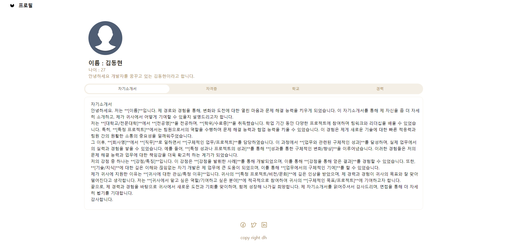
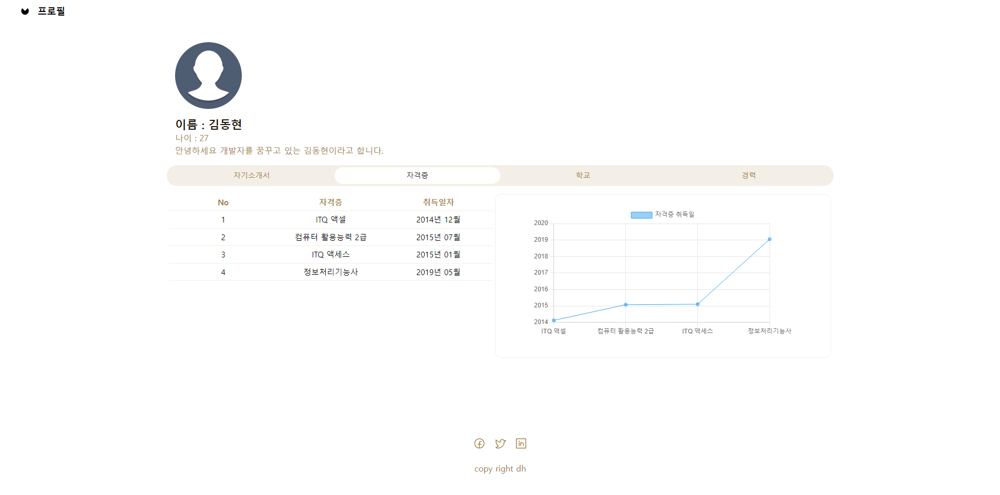
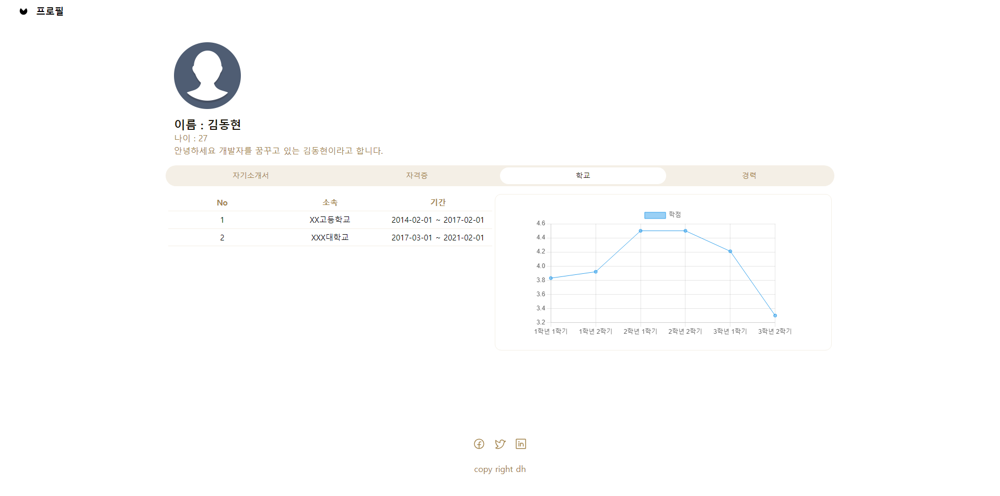
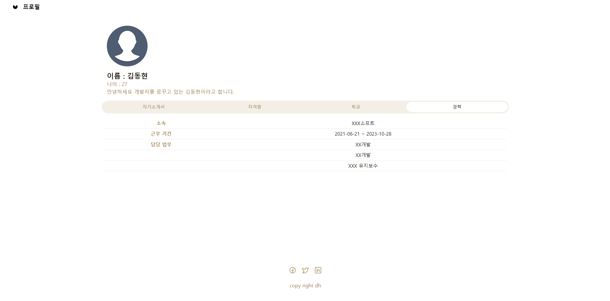
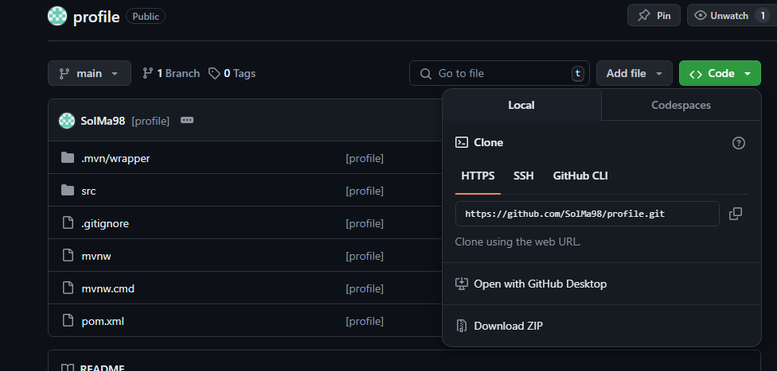

# PROFILE
Spring Boot, Chart.js를 활용해서 만든 프로필 웹 페이지

## 프로젝트 소개
웹 페이지에 본인의 프로필을 소개 할 수 있습니다.

### 프로젝트 이미지
[메인 페이지 - 자기소개서 탭]

[메인 페이지 - 자격증 탭]

[메인 페이지 - 학교 탭]

[메인 페이지 - 경력 탭]

### 프로젝트 다운로드 방법
1.Git hub url 접속

URL : https://github.com/SolMa98/profile

2.Clone Http 주소 복사

3.CMD에서 원하는 디렉터리에 위치

git clone {복사한 url}